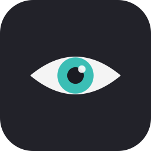

# Blink - Free Eye Care App for Mac | 20-20-20 Rule Screen Break Reminder

<p align="center">
  
</p>

<p align="center">
  <strong>Prevent digital eye strain with automatic screen break reminders</strong><br>
  The 20-20-20 rule: every 20 minutes, look 20 feet away for 20 seconds
</p>

<p align="center">
  <a href="https://github.com/tactilefx/blink-eye-care/releases"></a>&nbsp;
  &nbsp;
  &nbsp;
  
</p>

---

**Blink** is a free, open-source **macOS menu bar app** that reminds you to take screen breaks using the **20-20-20 rule**, the ophthalmologist-recommended method to prevent **digital eye strain** and **Computer Vision Syndrome**. It sits in your menu bar, counts down to your next break, then shows a calming full-screen overlay with a motivational message. A sound plays when the break ends.

**No subscriptions. No accounts. No tracking. No internet required. Just better eye health.**

> Looking for a **free alternative to Intermission**, Time Out, or LookAway? Blink does the same thing, for free, forever.

---

## Why Do You Need Blink?

Staring at screens for hours causes **digital eye strain** (also called **Computer Vision Syndrome**), affecting over 50% of computer users. Symptoms include:

- **Dry, irritated eyes** from reduced blink rate during screen use
- **Headaches and migraines** triggered by prolonged focus
- **Blurred vision** after long computer sessions
- **Neck and shoulder pain** from poor posture while straining to see

The **[American Academy of Ophthalmology](https://www.aao.org/)** recommends the **20-20-20 rule** as the simplest way to prevent screen-related eye problems. Blink automates this so you never forget to rest your eyes.

## Features

- **Menu Bar Countdown** - Always see when your next break is at a glance
- **Full-Screen Break Overlay** - Calming black screen with motivational text and animated countdown ring
- **Multi-Display Support** - Break screen appears on all connected monitors
- **10 Sound Options** - Built-in macOS sounds (Ping, Glass, Blow, Bottle, Frog, Funk, Hero, Morse, Pop, Submarine)
- **10 Motivational Messages** - Choose which messages rotate during breaks
- **Smart Pause** - Automatically pauses when your Mac sleeps or screen locks
- **Snooze** - Delay breaks by 15 min, 30 min, or 1 hour
- **Fully Configurable** - Break interval (5-60 min), duration (5-60 sec), sounds, messages
- **Pre-Break Notifications** - Optional heads-up before breaks start
- **Launch at Login** - Start automatically with your Mac
- **Native & Lightweight** - Pure Swift/SwiftUI, zero dependencies, under 1 MB
- **Privacy First** - No analytics, no data collection, no internet access required, no accounts

## Download & Install

### Option 1: Download DMG (Recommended)

1. Download **`Blink-1.0.0.dmg`** from [Releases](https://github.com/tactilefx/blink-eye-care/releases)
2. Open the DMG, drag **Blink** to **Applications**
3. Launch from Applications, the `👁` icon appears in your menu bar

### Option 2: Build from Source

```bash
git clone https://github.com/tactilefx/blink-eye-care.git
cd blink-eye-care
open Blink.xcodeproj
# Press ⌘R to build and run
```

### Requirements

- macOS 13.0 (Ventura) or later. Works on Ventura, Sonoma, and Sequoia
- Apple Silicon (M1/M2/M3/M4) or Intel Mac

## How It Works

1. **Launch Blink** - the `👁` icon appears in your menu bar with a countdown
2. **Work normally** - the timer counts down (e.g., `👁 18m`)
3. **Break time** - a full-screen black overlay appears with a motivational message
4. **Look away** - focus on something 20+ feet away while the countdown runs
5. **Break ends** - a sound plays, the overlay fades, and the next cycle starts
6. **Repeat** - your eyes stay healthy with zero disruption to your workflow

### Menu Bar Controls

| Action | What it does |
|--------|-------------|
| **Pause / Resume** | Temporarily stop or restart the timer |
| **Take Break Now** | Trigger an immediate eye break |
| **Skip Next Break** | Reset the timer without taking a break |
| **Snooze** | Delay the next break (15m / 30m / 1hr) |
| **Preferences** | Customize intervals, sounds, and messages |
| **Quit** | Exit Blink |

### During a Break

- Press **Esc** once to see a skip confirmation
- Press **Esc** again to skip the break
- Or click the **Skip** button

## Preferences

| Tab | Options |
|-----|---------|
| **General** | Break interval (5-60 min), break duration (5-60 sec), pre-break notifications, launch at login |
| **Sound** | 10 sound options with preview, volume slider, enable/disable |
| **Messages** | Toggle which motivational messages appear during breaks |
| **About** | Version info, links, license |

## Frequently Asked Questions

### What is the 20-20-20 rule?

The **20-20-20 rule** is an evidence-based technique recommended by eye doctors worldwide: every **20 minutes** of screen time, look at something **20 feet** away for at least **20 seconds**. This relaxes your eye muscles and restores your natural blink rate, which drops by up to 66% during screen use. [Studies show](https://www.healthline.com/health/eye-health/20-20-20-rule) it significantly reduces eye fatigue, dryness, and discomfort.

### Is Blink really free?

Yes. Blink is 100% free and open-source under the MIT license. No trials, no paywalls, no subscriptions, no "pro" tier. The code is right here on GitHub.

### Does Blink collect any data?

No. Blink has zero analytics, zero telemetry, and requires no internet connection. It doesn't even have network entitlements. Your break habits stay on your Mac.

### How is Blink different from Intermission or Time Out?

Blink does the same core job (screen break reminders using the 20-20-20 rule) but it's **free and open-source**. Intermission costs $7.99, Time Out has paid features, and LookAway costs $14.99. Blink is also native Swift (not Electron), so it uses minimal system resources.

### Does Blink work with multiple monitors?

Yes. The break overlay appears on all connected displays simultaneously.

### Can I customize the break intervals?

Yes. You can set the break interval from 5 to 60 minutes and the break duration from 5 to 60 seconds in Preferences.

### Does Blink pause when my Mac sleeps?

Yes. Blink automatically pauses the timer when your Mac sleeps or the screen locks, and resumes when you wake it up.

## Comparison: Blink vs Other Eye Break Apps

| Feature | Blink | Intermission | Time Out | LookAway | Stretchly |
|---------|-------|-------------|----------|----------|-----------|
| **Price** | Free | $7.99 | $6.99 | $14.99 | Free |
| **Open Source** | Yes (MIT) | No | No | No | Yes |
| **Native macOS** | Yes (Swift) | Yes | Yes | Yes | No (Electron) |
| **Menu Bar Timer** | Yes | Yes | No | Yes | Yes |
| **Multi-Display** | Yes | Yes | Yes | Yes | Yes |
| **Customizable Sounds** | 10 options | Limited | Limited | Yes | Yes |
| **Auto-Pause on Sleep** | Yes | Yes | Yes | Yes | Yes |
| **App Size** | ~500 KB | ~25 MB | ~15 MB | ~20 MB | ~200 MB |

## Tech Stack

| | |
|---|---|
| **Language** | Swift 5 |
| **UI** | SwiftUI + AppKit |
| **Platform** | macOS 13+ (Ventura, Sonoma, Sequoia) |
| **Dependencies** | Zero, no third-party libraries |
| **Architecture** | Pure AppKit lifecycle (`main.swift`) |
| **App Size** | ~500 KB |

## Project Structure

```
Blink/
├── main.swift                  # App entry point
├── AppDelegate.swift           # Menu bar, preferences, app lifecycle
├── TimerManager.swift          # Core 20-20-20 countdown timer
├── BreakWindowController.swift # Full-screen overlay on all displays
├── SoundManager.swift          # Break-end sound playback
├── PreferencesView.swift       # SwiftUI settings (4 tabs)
└── Models/
    ├── AppSettings.swift       # UserDefaults-backed settings
    ├── SoundOption.swift       # 10 built-in macOS sounds
    └── MotivationalTexts.swift # 10 motivational messages
```

## Contributing

Contributions are welcome! Please open an issue or submit a pull request.

**Ideas for contributions:**
- Custom motivational messages
- Global keyboard shortcut to trigger break
- Break statistics (daily/weekly eye break tracking)
- Menu bar icon customization
- Localization (translations for other languages)
- Homebrew cask formula

## Related Topics

`eye-care` `eye-strain` `20-20-20` `screen-break` `break-reminder` `break-timer` `digital-eye-strain` `computer-vision-syndrome` `macos` `mac` `swift` `swiftui` `open-source` `menu-bar` `productivity` `health` `digital-wellness` `rsi-prevention` `eye-saver` `pomodoro`

## License

[MIT License](LICENSE)

---

<p align="center">
  <strong>If Blink helps protect your eyes, consider giving it a ⭐</strong><br>
  <sub>It helps other developers and screen workers discover this free tool</sub>
</p>

<br>

<p align="center">
  <sub>Also by tactilefx: <a href="https://subcut.xyz"><strong>Subcut</strong></a> - Upload a bank statement, instantly find every subscription you're paying for. Available on <a href="https://subcut.xyz">iOS</a>.</sub>
</p>
